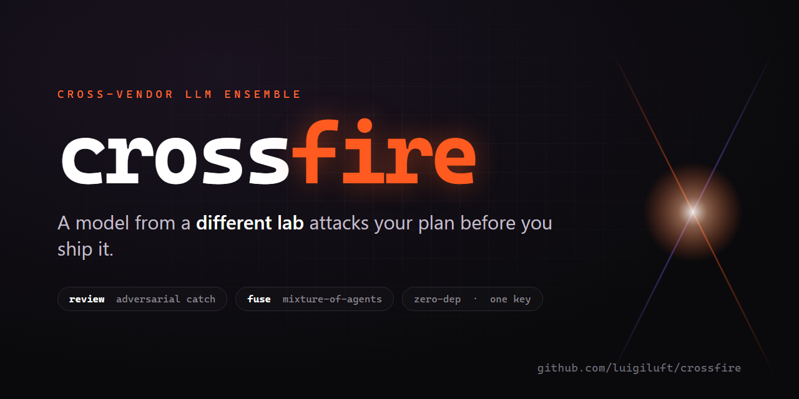
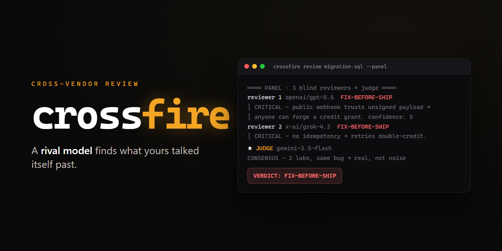

<p align="center">
  
</p>

<p align="center">
  <a href="LICENSE"></a>
  = 18" src="https://img.shields.io/badge/node-%E2%89%A518-3fb950">
  
  
</p>

<p align="center">
  <b>A model from a different lab attacks your work before you ship it.</b><br>
  Cross-vendor adversarial review <i>and</i> mixture-of-agents — in one zero-dependency CLI.
</p>

---

**What** · a tiny CLI that runs a cross-vendor LLM ensemble over your plans, diffs, and code.<br>
**Why** · an AI that reviews its own work shares its own blind spots, so crossfire borrows a model from a *different lab* to catch what yours rationalized past.<br>
**Proof** · in one run, two models from different vendors independently flagged a billing bypass a human had shipped past. ([see it ↓](#see-it-work))<br>
**Try** · `npx github:luigiluft/crossfire review plan.md --type plan`

---

<p align="center">
  <a href="#quickstart">Quickstart</a> ·
  <a href="#review-adversarial-catch">Review</a> ·
  <a href="#fuse-mixture-of-agents">Fuse</a> ·
  <a href="#why-cross-vendor">Why cross-vendor</a> ·
  <a href="#design-notes">Design</a>
</p>

---

## Why this exists

When an AI agent writes a plan and then "reviews" it, you're asking the same training
distribution to catch its own rationalizations. It can't — **the blind spot that produced the
bug is the blind spot reviewing for it.** That's model monoculture.

The fix isn't a smarter prompt. It's a **different lab**. A model from another vendor has a
different training distribution, so it flags the thing yours talked itself past. When two
models from *different* vendors independently flag the same defect, that agreement is the
strongest signal of a real bug you can get cheaply.

crossfire is the smallest possible tool that turns that idea into a command. Two axes:

- **`crossfire review`** — *catch*. An adversarial reviewer (or a blind panel + judge) from a different vendor tears your plan, diff, or code apart **before** you execute it.
- **`crossfire fuse`** — *generate*. Mixture-of-Agents: several diverse models answer in parallel, a strong aggregator synthesizes the single best answer.

No SDKs, no framework, no account beyond one OpenRouter key — just two small commands over a shared HTTP layer, native `fetch`, zero dependencies.

---

## Quickstart

```bash
# 1. Get an OpenRouter key → https://openrouter.ai/keys
export OPENROUTER_API_KEY=sk-or-...

# 2. Run straight from GitHub — no install
npx github:luigiluft/crossfire review path/to/plan.md --type plan

# or clone and link the `crossfire` command
git clone https://github.com/luigiluft/crossfire
cd crossfire && npm link
crossfire review diff.txt --type diff
```

Input comes from a **file argument or stdin**, so it pipes from `git diff`, your editor, or an agent hook:

```bash
git diff main...HEAD | crossfire review --type diff
```

---

## Commands & flags

```bash
crossfire review <file|->   [flags]    # critique a plan / diff / code
crossfire fuse   "<prompt>"  [flags]   # generate the best answer (mixture-of-agents)
```

| Flag | review | fuse | What it does |
|------|:------:|:----:|------|
| `--type plan\|diff\|code` | ✓ | | how to read the input (default `code`) |
| `--panel` | ✓ | | N blind reviewers + a judge (default is solo) |
| `--no-structure` | | ✓ | skip the prompt-cleanup step |
| `--show-prompt` | | ✓ | also print the structured prompt + each proposal |
| `--safe` | ✓ | ✓ | Western-vendor set only — for client / regulated data |
| `--context "..."` | ✓ | ✓ | extra context handed to every model |
| `--lang pt\|es\|fr\|de` | ✓ | ✓ | output language (default `en`) |
| `--json` | ✓ | ✓ | machine-readable output |
| `--check` | ✓ | ✓ | validate every model slug against OpenRouter, then exit |
| `--model` `--reviewers` `--judge` | ✓ | | override which models run (solo / panel) |
| `--proposers` `--aggregator` | | ✓ | override which models run |

---

## See it work

Run the bundled example — a credit-top-up plan with deliberate, realistic defects:

```bash
crossfire review examples/plan-with-bug.md --type plan --panel
```

<p align="center">
  
</p>

Four reviewers from four different vendors, each blind to the others, all returned
`FIX-BEFORE-SHIP`. The judge promoted what **two independent labs** flagged into consensus:
a public webhook that trusts an unsigned payload (forged credit grants), and no idempotency
(Stripe retries double-credit). Two labs, same bug → real, not noise.

The full, unedited run is in [`examples/panel-output.txt`](examples/panel-output.txt).

---

## Review: adversarial catch

| Mode | What | Cost | Use for |
|------|------|------|---------|
| `--solo` (default) | one reviewer from another vendor | ~$0.001–0.004 | the daily gate; cheap enough to automate |
| `--panel` | N blind reviewers (different vendors) + a judge | ~$0.05–0.20 | expensive, hard-to-reverse, architectural calls |

The judge does **not** average the reviews. It distills signal into sections:

- **Consensus** — what ≥2 independent models flagged (promote: strong signal of a real bug)
- **Disagreement** — where they conflict; it exposes the trade-off instead of deciding for you
- **To verify** — schema / contract / data-binding claims it can't confirm from the input alone (never silently dropped as "noise")
- **Discarded noise** — generic best-practice with no concrete trigger, each with a one-line why

Every reviewer ends on a hard verdict — `SHIP` / `FIX-BEFORE-SHIP` / `RECONSIDER-APPROACH`. No hedging.

```bash
crossfire review migration.sql --type diff --panel
crossfire review plan.md --type plan --solo --model openai/gpt-5.4-mini
```

## Fuse: mixture-of-agents

For open, hard problems where diversity beats raw power. Pipeline:

1. **Structure** — rewrite your raw prompt into a clean spec (objective / context / constraints / output). `--no-structure` to skip.
2. **Propose** — N diverse models answer in parallel.
3. **Aggregate** — one strong model synthesizes the best single answer, told explicitly that some inputs may be wrong.

```bash
crossfire fuse "what's the cleanest schema for multi-tenant soft-delete?"
crossfire fuse prompt.md --show-prompt        # show the structured prompt + each proposal
```

Based on [Mixture-of-Agents Enhances LLM Capabilities](https://arxiv.org/abs/2406.04692) (Wang et al., 2024).

---

## Why cross-vendor

A self-review reuses the same weights, so it inherits the same blind spots. crossfire's panel
deliberately spans **different vendors / training lineages** and never includes the model that
produced the work. Independence is the engine:

> Two models from different labs flagging the same defect isn't a coincidence — it's the
> cheapest strong evidence of a real bug you can buy.

The judge treats that agreement as **consensus** and treats disagreement as a decision *you*
own, not something to average away.

## Privacy: `--safe`

Default panels include models from multiple regions for maximum training diversity. For
**client or regulated data**, pass `--safe` to restrict to a vetted Western-vendor set —
crossfire warns you if a region-sensitive model is in the active set.

```bash
crossfire review prod-migration.sql --panel --safe --context "client PII"
```

## Output language

Defaults to English. Set `--lang pt|es|fr|de` (or `CROSSFIRE_LANG` in your env) for reviews and
answers in your language — the analysis is identical, only the prose changes.

## Plug into your agent

crossfire is stdin-friendly on purpose. Wire it as a pre-execution gate in Claude Code, Cursor,
a pre-commit hook, a CI step, or your agent's "before high-risk action" path:

```bash
git diff main...HEAD | crossfire review --type diff --solo
```

Solo is cheap and deterministic enough to run on every risky change; escalate to `--panel` for
the calls you can't easily undo.

---

## Design notes (why it won't lie to you)

- **Never throws on a network blip** — a connection hiccup can't make the gate report "no issues found". Network errors retry; HTTP errors don't (they're deterministic).
- **Panel degrades gracefully** — dead model slug? Skipped, the panel continues. Judge dies? Falls back to a different vendor. One reviewer left? It says so instead of faking a consensus.
- **Raw reviews printed before the judge's synthesis** — you can always audit the judge against the source. Never accept a synthesis blind.
- **The judge is blind to who said what** — reviews and proposals reach the judge/aggregator anonymized (`Response A/B/C`), so a familiar brand can't sway the verdict and no model can favor its own family. You still see every vendor in the output; only the judge is kept blind.
- **Confidence-capped findings** — a reviewer that can't name the exact input that triggers a failure is capped at low confidence, so you can discard hallucinated "bugs".
- **Slugs rot** — `crossfire review --check` validates every model slug against OpenRouter's live catalog. A weekly CI job ([`.github/workflows/slug-check.yml`](.github/workflows/slug-check.yml)) does it for you.

## Cost & configuration

Cost is live-estimated from OpenRouter pricing and printed to stderr after each run. Ballpark:
solo review ≈ $0.002, panel ≈ $0.05–0.20 (scales with artifact size), fuse ≈ $0.10–0.17. You
bring your own key; crossfire takes no cut.

Default model slugs live at the top of `cross-review.mjs` and `fusion.mjs`. Override per run with
`--reviewers`, `--judge`, `--model` (review) or `--proposers`, `--aggregator` (fuse). Run
`crossfire review --check` to see which slugs are still live and swap as needed.

## License

[MIT](LICENSE).
